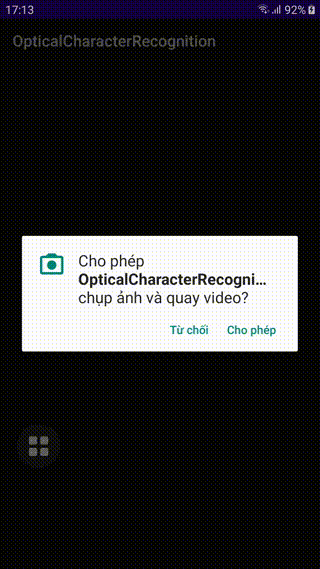

# Tensorflow Lite Practice
Đây là một số ứng dụng Android mình đã tạo ra trong quá trình học về Tensorflow Lite cũng như thư viện CameraX, tất cả được viết bằng Kotlin.

Cụ thể như sau:
- Object Detection
- Text Detection + Text Recognition (hay còn gọi là Optical Character Recognition - OCR)

## Screenshot

## Các nguồn tham khảo

[https://www.tensorflow.org/lite/examples]()

[https://developer.android.com/codelabs/camerax-getting-started#0]()

[https://codelabs.developers.google.com/codelabs/recognize-flowers-with-tensorflow-on-android#0]()

[https://developers.google.com/codelabs/tflite-object-detection-android#0]()